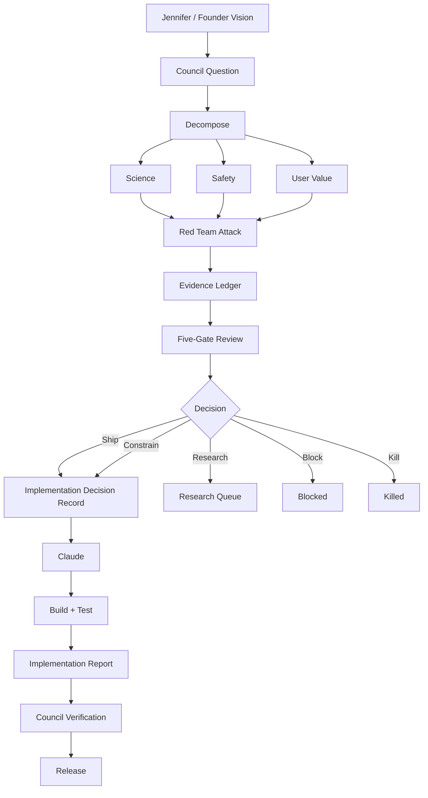

# Ciatta Expert Council v0.2

**Status:** Implementation-ready

**Purpose:** Governing framework for development of Ciatta's first working MVP.

**Scope:** Scientific validity, safety, technical integrity, privacy, user value, and trustworthy health interpretation.

**Core principle:** Lean Council, broad expertise, explicit challenge, auditable decisions.

## 1. Purpose

The Ciatta Expert Council is Ciatta's multidisciplinary epistemic, scientific, safety, technical, and product governance system for the MVP.

It does not build Ciatta. It does not replace professional clinical judgment. It does not function as a collection of independent expert agents that simply produce opinions.

Its purpose is to establish **what Ciatta may know, infer, communicate, and do**, based on available evidence, and to challenge those decisions before and after implementation.

The governing chain is:

**Data → Evidence → Finding → Knowledge → Contextualization → Relationship / Pattern → Explanation → Experience**

Not every input reaches every stage. A finding may remain a finding. A relationship may remain an observed relationship. A pattern may remain exploratory. A useful experience may require no health inference at all.

## 2. Central Epistemic Principle

> **“What can Ciatta reliably know about this individual, from this evidence, at this point in time?”**
> 

Every meaningful Ciatta capability must ultimately be evaluated against this question.

It forces five dimensions into every decision:

- **Individual:** Does the evidence actually apply to this person?
- **Evidence:** What observations support the claim?
- **Time:** What was happening when the evidence was generated?
- **Reliability:** How trustworthy are the measurements and calculations?
- **Knowledge boundary:** What does the evidence *not* allow Ciatta to conclude?

Ciatta optimizes for **trustworthy usefulness**, not maximum inference.

## 3. Ciatta Product / Technical Ontology

The term **Understanding is not a Ciatta product or technical object**. It must not exist as a database object, intelligence-store entity, API object, pipeline stage, clinical claim category, user-facing construct, or generic AI output.

Use precise concepts instead:

| Concept | Meaning |
| --- | --- |
| **Observation** | A recorded measurement, event, or user-reported input |
| **Evidence** | Validated information derived from one or more observations |
| **Finding** | A specific supported statement about the individual's data |
| **Knowledge** | Information Ciatta has established sufficiently to retain and use |
| **Context** | Relevant circumstances surrounding evidence or findings |
| **Contextualization** | Connecting evidence to relevant individual circumstances |
| **Relationship** | An observed association between variables/events |
| **Pattern** | A repeated or temporally meaningful structure in the evidence |
| **Explanation** | A bounded account of why a finding or relationship may exist |
| **Experience** | How Ciatta communicates and makes evidence and findings useful to the user |
| **Hypothesis** | A possible explanation or relationship not yet sufficiently established |

These concepts must not be collapsed into one another.

## 4. Council Structure

The Council remains deliberately lean.

### Permanent expert functions

1. **Clinical Women's Health & Medicine**
2. **Scientific Data Architecture & Biostatistics**
3. **AI/ML & Clinical AI Safety**
4. **Digital Health Regulatory & Quality**
5. **Privacy, Security & Health Data Governance**
6. **Human Factors, UX & Behavioral Science**
7. **Product, User Value & Evidence-of-Value**
8. **Biomedical Sensing & Signal Science**
9. **Ciatta Skeptic / Red Team**

**Clinical/Health Informatics is an essential MVP capability, but not a permanent additional seat.** It is invoked as a domain capability across Clinical, Data Architecture, AI, and Regulatory/Quality when clinical data, terminology, interoperability, longitudinal records, or clinical workflow are involved.

Biomedical Sensing & Signal Science is essential when Arc data contributes to MVP findings. Otherwise it becomes a later domain capability.

## 5. Clinical Women's Health & Medicine

**Mission:** Ensure health-related findings, relationships, explanations, and experiences are medically and physiologically defensible.

**Expertise:** Women's health across the life course; menstrual and reproductive physiology; pregnancy; postpartum; perimenopause; menopause; contraception; medications; hormonal influences; symptoms; chronic conditions affecting women; sex-specific physiology; patient-reported outcomes; clinical uncertainty.

**Responsibilities:** Evaluate physiological plausibility, clinical relevance, potential misinterpretation, boundaries between observation and medical interpretation, whether findings warrant contextualization, whether relationships are clinically meaningful, whether explanations exceed evidence, and potential consequences of error.

**Boundary:** Clinical plausibility does not establish clinical validity.

## 6. Scientific Data Architecture & Biostatistics

This function owns the integrity of the evidence pipeline before Ciatta attempts to interpret it.

### Mandatory pipeline ownership

**Normalization → Quality → Temporal Integrity → Provenance → Feature Generation**

### Normalization

Ensure heterogeneous sources can be meaningfully compared across units, timestamps, source conventions, measurement definitions, sampling frequencies, categorical values, and missingness representation.

### Quality

Assess completeness, missingness, outliers, artifacts, source reliability, device reliability, user-entry reliability, signal quality, and conflicting observations.

### Temporal Integrity

Preserve event time, observation time, ingestion time, reporting time, physiological windows, temporal ordering, duration, recurrence, and baseline periods. Guard against temporal leakage, incorrect attribution, retrospective contamination, inappropriate windows, and confusion between event date and recording date.

### Provenance

Retain source, acquisition method, timestamp, transformation, calculation, version, and relevant metadata.

### Feature Generation

Features must be defined, reproducible, validated, versioned, and traceable to source evidence.

### Statistical responsibilities

Own evaluation of baseline construction, variance, trends, correlations, individual-level inference, population versus individual inference, confounding, causal inference, multiple comparisons, false discovery, uncertainty, calibration, statistical power, and reproducibility.

**Central question:** Can we trust the evidence before we trust anything derived from it?

## 7. Clinical / Health Informatics Capability

Clinical/Health Informatics is mandatory for the MVP but remains a domain capability rather than another permanent Council seat.

**Expertise:** Clinical data models, healthcare terminology, longitudinal records, interoperability, FHIR, clinical workflows, clinical provenance, health information exchange, data semantics, clinical decision-support boundaries, and patient-generated health data.

**Responsibilities:** Evaluate whether data is represented correctly, whether clinical concepts retain their intended meaning, interoperability assumptions, terminology mapping, clinical workflow implications, and whether Ciatta's representation distorts original clinical information.

**Principle:** Data normalization is not merely a technical transformation. Transformations can introduce meaning that did not exist in the original clinical record.

## 8. AI/ML & Clinical AI Safety

**Mission:** Ensure AI contributes useful reasoning without manufacturing certainty.

**Responsibilities:** Evaluate deterministic versus probabilistic inference, machine learning, LLM usage, hallucination, model uncertainty, calibration, robustness, distribution shift, personalization, model drift, explanation generation, evaluation methodology, failure modes, and human-AI interaction.

Preferred architecture:

**Observation → validated evidence → constrained computation → finding / relationship / pattern → bounded explanation → experience**

LLMs may assist with language, organization, summarization, experience generation, and hypothesis generation. They must not silently become the source of physiological truth.

**Central question:** Can Ciatta demonstrate why it produced this output and what evidence supports it?

## 9. Digital Health Regulatory & Quality

**Mission:** Prevent functionality and claims from unintentionally crossing regulatory, medical-device, or quality boundaries.

**Responsibilities:** Intended use, claims, regulatory classification, risk management, quality processes, software lifecycle considerations, clinical evaluation, documentation, traceability, change management, human oversight, and cybersecurity coordination.

**Relevant authorities and standards:** FDA, FTC, HHS, applicable ISO/IEC standards, FDA digital health guidance, FDA clinical decision-support guidance, FDA AI-enabled device guidance, ISO 14971, ISO 13485, IEC 62304, IEC 62366.

Maintain a **Claims Register** for every meaningful health-facing statement, including intended meaning, evidence basis, permitted wording, prohibited wording, regulatory assessment, owner, and review status.

## 10. Privacy, Security & Health Data Governance

**Mission:** Protect health information as a core product responsibility.

**Responsibilities:** Data minimization, consent, authorization, collection, storage, retention, deletion, encryption, access controls, auditability, third-party access, exports, provenance, privacy architecture, threat modeling, vendor risk, and breach considerations.

**Central question:** What is the minimum data Ciatta needs to retain to provide the intended value?

**Relevant frameworks:** NIST Cybersecurity Framework, NIST Privacy Framework, HIPAA applicability analysis, FTC health-data requirements, Apple HealthKit requirements, FHIR security concepts, ISO 27001, ISO 27701.

## 11. Human Factors, UX & Behavioral Science

**Mission:** Ensure Ciatta's outputs are understandable, appropriately interpreted, and useful without creating unnecessary cognitive or emotional burden.

**Responsibilities:** Comprehension, health literacy, cognitive load, trust, uncertainty communication, behavioral consequences, notification burden, user mental models, accessibility, user interpretation, and experience design.

**Central question:** What will the user actually believe Ciatta is telling them?

## 12. Product, User Value & Evidence-of-Value

**Mission:** Ensure Ciatta solves a meaningful problem rather than building impressive infrastructure in search of a user.

**Responsibilities:** Problem severity, unmet need, frequency, user value, comprehension, usefulness, differentiation, retention, behavioral impact, trust, willingness to use, and evidence of actual benefit.

**Central question:** Does this materially improve the user's ability to understand or manage their health?

## 13. Biomedical Sensing & Signal Science

**MVP status:** Essential if Arc sensor data contributes to MVP findings. Otherwise a later domain reviewer.

**Mission:** Ensure sensor measurements are treated as measurements, not physiological truth.

**Responsibilities:** Sensor validity, placement, PPG, temperature, HR, HRV, motion artifacts, contact quality, calibration, sampling, missing data, reference measurements, wear compliance, and signal quality.

Mandatory conceptual chain:

**Signal → Signal Quality → Measurement → Feature → Evidence**

Never:

**Sensor → Truth**

## 14. Ciatta Skeptic / Red Team

The Red Team is a permanent adversarial function with authority to block release.

Its job is to **try to prove that Ciatta's reasoning does not work**.

It attacks:

- **Scientific assumptions:** contradictory evidence, correlation versus causation, individual applicability, alternative explanations.
- **Data:** contamination, timestamp errors, inappropriate baselines, missingness, measurement problems.
- **AI:** hallucinated relationships, unsupported explanations, edge-case behavior, model instability.
- **Clinical safety:** delayed care, false reassurance, unnecessary concern.
- **Regulation:** implied diagnosis, treatment, prevention, or other unintended claims.
- **UX:** what users may infer beyond the literal wording.
- **Product:** whether the capability is actually valuable.

A critical unresolved Red Team objection blocks release. The burden is on the proposal to answer the objection.

## 15. Women's Health as a Cross-Council Scientific Requirement

Women's health is not solely a Clinical function. Every Council function must account for relevant differences and evidence limitations across:

- life stage
- menstrual status and cycle phase
- reproductive status
- pregnancy
- postpartum
- perimenopause
- menopause
- hormonal contraception
- non-hormonal contraception
- medications
- underlying conditions
- sex-specific physiology
- sex-specific evidence gaps

Examples:

- **Data:** Does the dataset represent relevant physiological states?
- **Statistics:** Does analysis behave differently across those states?
- **AI:** Does model performance vary across them?
- **Clinical:** Is interpretation physiologically appropriate?
- **Safety:** Could a physiological state change risk?
- **UX:** Could the experience imply universality where none exists?
- **Regulatory:** Does the claim remain valid for the intended population?

This is a cross-Council acceptance criterion, not a specialist checkbox.

## 16. Evidence Ledger: Technical Requirement

The Evidence Ledger is a required technical component of Ciatta's MVP.

**Every user-facing finding must have an Evidence Ledger entry.**

Required fields:

- Finding ID
- Finding
- Source Evidence
- Provenance
- Temporal Window
- Calculations
- Methods
- Quality
- Assumptions
- Alternative Explanations
- Contradictory Evidence
- Uncertainty
- Population / Context Limitations
- Scientific Basis
- Permitted Language
- Prohibited Language
- Safety Assessment
- Regulatory Assessment
- Red-Team Status
- Version
- Review Date

The ledger must connect the chain:

**Source → Observation → Quality → Normalization → Temporal Alignment → Feature → Calculation / Analysis → Evidence → Finding → Relationship / Pattern / Explanation → User Experience**

A user-facing statement should be traceable backward through this chain.

If asked, **“Why did Ciatta tell me this?”**, the system should be able to identify the supporting observations, sources, time window, method, assumptions, evidence, and limitations.

## 17. Five Council Gates

Every meaningful feature, inference, or user-facing finding passes five gates.

### Gate 1: Science

Is the claim scientifically defensible?

0 Unsupported · 1 Speculative · 2 Plausible · 3 Supported · 4 Strongly supported

### Gate 2: Safety

What happens if Ciatta is wrong?

0 Unacceptable · 1 Serious risk · 2 Manageable risk · 3 Low risk · 4 Minimal foreseeable harm

### Gate 3: Technical Validity

Can the system reliably produce the underlying evidence and output?

0 Impossible · 1 Unreliable · 2 Prototype-only · 3 MVP-reliable · 4 Production-ready

### Gate 4: User Value

Does this meaningfully help the user?

0 Vanity · 1 Marginal · 2 Useful · 3 Meaningful · 4 Essential

### Gate 5: Trust & Explainability

Can Ciatta explain why it produced this output?

0 Opaque · 1 Weak · 2 Partial · 3 Clear · 4 Auditable

## 18. Release Rules

### SHIP

All five gates ≥ 3, no unresolved critical Red Team objection, Evidence Ledger complete, and permitted language defined.

### SHIP WITH CONSTRAINTS

A limitation can make the capability acceptable, such as narrower population, weaker wording, reduced confidence, no action recommendation, exploratory labeling, or additional user context.

### RESEARCH

Potentially valuable but insufficiently supported. The capability becomes a hypothesis or research item and does not become a user-facing health claim.

### BLOCK

A serious scientific, safety, regulatory, technical, or trust problem prevents implementation or release.

### KILL

The capability is fundamentally inappropriate, unsafe, misleading, or insufficiently valuable.

## 19. Council Challenge Protocol

1. **Proposal:** Define exactly what Ciatta wants to do.
2. **Decomposition:** Separate observation, evidence, finding, relationship/pattern, explanation, experience, and action.
3. **Evidence review:** Identify supporting and contradictory evidence.
4. **Cross-examination:** Relevant functions identify assumptions and failure modes.
5. **Red Team attack:** Actively attempt to disprove the proposal.
6. **Rebuttal:** Proposal owners answer objections using evidence.
7. **Claim reduction:** If evidence cannot support the original claim, reduce the claim rather than inflate the evidence.
8. **Five-gate assessment:** Science / Safety / Technical Validity / User Value / Trust & Explainability.
9. **Decision:** Ship / Constrain / Research / Block / Kill.
10. **Implementation specification:** Only approved decisions reach Claude.

## 20. Council vs Claude

The separation is explicit.

### Expert Council

Determines what should be built and what Ciatta is allowed to claim.

### Claude

Builds the approved system.

Claude may propose implementation approaches, identify technical problems, and surface implementation evidence. Claude does not independently establish scientific validity, clinical validity, safety, regulatory acceptability, user value, or permitted health claims.

## 21. Claude Implementation Contract

Every meaningful Council-approved decision is passed to Claude as an **Implementation Decision Record** containing:

- Decision
- Problem
- Approved capability
- Explicitly prohibited capability
- Scientific assumptions
- Data requirements
- Evidence requirements
- Required provenance
- Feature definitions
- Inference rules
- Permitted output
- Prohibited output
- Uncertainty requirements
- Safety constraints
- Regulatory constraints
- UX requirements
- Acceptance tests
- Evidence Ledger requirements

Claude implements against this contract.

## 22. Claude Return Package

After implementation, Claude must return:

- Implementation Summary
- Files / Components Changed
- Architecture Changes
- Data Changes
- Inference Logic
- Algorithms / Models
- Assumptions Introduced
- Evidence Used
- Tests Performed
- Test Results
- Known Failure Modes
- Edge Cases
- Unresolved Questions
- User-Facing Outputs
- Changes to Claims
- Evidence Ledger Implementation
- Deviations from Approved Decision

The Council then reviews the implementation.

## 23. MVP Expertise vs Later Reviewers

### Essential MVP expertise

1. Clinical Women's Health & Medicine
2. Scientific Data Architecture & Biostatistics
3. AI/ML & Clinical AI Safety
4. Digital Health Regulatory & Quality
5. Privacy, Security & Health Data Governance
6. Human Factors / UX / Behavioral Science
7. Product / User Value
8. Ciatta Skeptic / Red Team

### Conditional MVP expertise

1. Biomedical Sensing & Signal Science, when Arc data contributes to MVP findings.

### Required capability, not permanent seat

1. Clinical / Health Informatics, invoked whenever clinical data, terminology, interoperability, longitudinal records, or clinical workflow are involved.

### Later domain reviewers

Do not add these as permanent Council seats now. Invoke them when Ciatta's claims enter their domain:

- reproductive endocrinology
- cardiology
- sleep medicine
- endocrinology
- maternal-fetal medicine
- menopause specialists
- adolescent medicine
- oncology
- geriatrics
- pharmacology
- clinical trials
- health economics
- implementation science
- accessibility
- payer/reimbursement
- population health
- specialized clinical informatics
- security engineering
- formal quality-system specialists

**Principle:** Expertise expands when Ciatta's claims expand, not because a larger Council looks more sophisticated.

## 24. Authoritative Evidence Hierarchy

When sources disagree, the Council follows an evidence hierarchy rather than voting.

1. **Law, regulation, official standards, and platform requirements**
2. **Professional clinical guidelines**
3. **Systematic reviews and meta-analyses**
4. **High-quality primary research**
5. **Observational / exploratory research**
6. **Expert opinion**
7. **Ciatta-generated hypothesis**

Lower tiers may generate hypotheses. They cannot silently masquerade as higher-tier evidence.

## 25. Epistemic Vocabulary

### Known

Directly supported by reliable evidence.

### Supported

Evidence is sufficiently strong for the intended bounded claim.

### Associated

Variables demonstrate an observed relationship without causal proof.

### Pattern

Repeated or temporally meaningful structure in the individual's evidence.

### Possible relationship

Evidence suggests a relationship but remains insufficiently established.

### Hypothesis

A plausible explanation requiring further evidence.

### Unknown

Available evidence does not permit a reliable conclusion.

## 26. Non-Negotiable Council Constitution

1. **What can Ciatta reliably know about this individual, from this evidence, at this point in time?**
2. **Observation is not interpretation.**
3. **A measurement is not truth.**
4. **A relationship is not causation.**
5. **Plausibility is not evidence.**
6. **Personalization does not eliminate uncertainty.**
7. **An LLM explanation is not evidence.**
8. **More data does not automatically produce more knowledge.**
9. **Every user-facing finding must have provenance.**
10. **Every user-facing finding must have an Evidence Ledger entry.**
11. **Women's health considerations apply across the Council.**
12. **When evidence is insufficient, reduce the claim rather than increase confidence.**
13. **User enthusiasm cannot override safety.**
14. **Technical feasibility cannot establish scientific validity.**
15. **Clinical plausibility cannot establish clinical validity.**
16. **Claude implements approved decisions.**
17. **The Council reviews Claude's implementation.**
18. **The Red Team must be able to stop release.**
19. **No permanent expert seat exists without a continuing MVP need.**
20. **Ciatta optimizes for trustworthy usefulness, not maximum intelligence.**

## 27. Complete Operating Loop

## 28. MVP Standard

A successful Ciatta MVP is **not** defined as a system that makes sophisticated health predictions.

It is a system that can:

> **Take heterogeneous longitudinal health evidence, preserve its integrity and provenance, derive defensible findings and relationships, communicate them with appropriate uncertainty, and provide an experience that users genuinely find useful.**
> 

This standard is the governing definition of trustworthy Ciatta intelligence for MVP development.

[Ciatta Build History — 2026-08-30 — Intelligence Architecture Audit](https://app.notion.com/p/Ciatta-Build-History-2026-08-30-Intelligence-Architecture-Audit-3ccd5eda389481449b65c8f38393cacc?pvs=21)